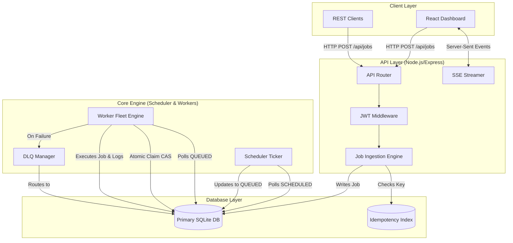
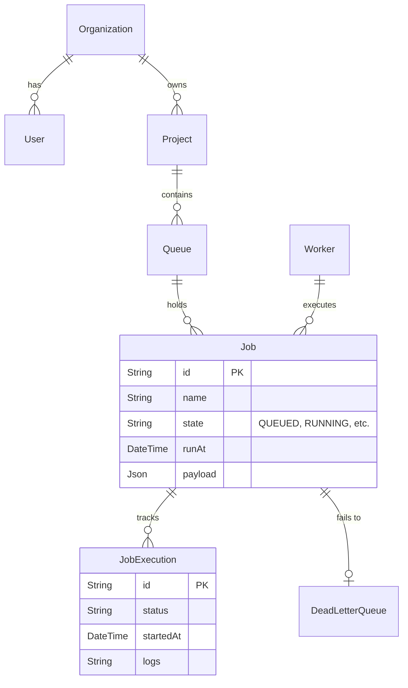

<div align="center">
  <p style="color: #64748b; font-weight: 600; letter-spacing: 1px;">CODITY.AI</p>
  <p style="color: #64748b; font-size: 1.1rem;">Internship Technical Assignment</p>
  <h1 style="color: #0f172a; font-size: 2.5rem; margin-top: 10px; margin-bottom: 10px;">DISTRIBUTED JOB SCHEDULER</h1>
  <p style="color: #475569; font-size: 1.1rem;">Production-inspired asynchronous background job scheduling platform</p>
</div>

<br/>

| | |
|---|---|
| **Source Code** | [GitHub Repository](https://github.com/nivedhavenkatesan2005-09/Distributed-Job-Scheduler) |
| **Live Demo** | [Open Live Demo](https://job-scheduler-demo.onrender.com) |
| **Implementation** | Node.js / Express / TypeScript / React / Vite / Prisma / SQLite / Jest / SSE |

> **Note:** Submission package covering the assignment deliverables: source/setup reference, architecture, database/ER design, REST API documentation, design decisions, and automated testing.

---

## 1. Project Overview
The Distributed Job Scheduler is a decoupled, asynchronous background processing platform designed to execute jobs reliably across multiple workers. The implementation separates the API/ingestion layer from the scheduler and worker execution layer, while exposing a responsive React dashboard for job, queue, and worker monitoring.

The assignment emphasizes backend engineering, database design, concurrency, reliability, API design, and full-stack implementation, with engineering quality and maintainability prioritized over simply maximizing feature count.

### Key Implemented Capabilities
- **Job lifecycle management:** Queued → Scheduled → Claimed → Running → Completed/Failed.
- **Atomic job claiming:** Uses a database compare-and-swap (CAS) mechanism to prevent duplicate execution.
- **API-level idempotency:** Leverages `Idempotency-Key` request headers to safely handle retries.
- **Retry handling:** Configurable policies, including exponential backoff and fixed delay.
- **Dead Letter Queue (DLQ):** Automatic routing for permanent failures.
- **Worker fleet execution:** Full concurrency controls and graceful shutdown support.
- **Real-time telemetry:** Dashboard updates powered by Server-Sent Events (SSE).
- **Automated Testing:** Jest unit tests and an in-app synthetic verification suite for concurrency invariants.

---

## 2. Source Code & Setup Instructions
The complete source code is maintained in the public GitHub repository.

### Repository Structure
- `server/` — Backend/server-side API and engine implementation
- `src/` — Frontend React dashboard
- `prisma/` — Prisma schema and database configuration
- `tests/` — Jest automated tests
- `docs/` — Architecture, database, API, and design documentation
- `README.md` — Setup and configuration reference

### Local Setup
1. **Install Node.js:** Requires v18+.
2. **Clone the repository:** 
   ```bash
   git clone https://github.com/nivedhavenkatesan2005-09/Distributed-Job-Scheduler.git
   cd Distributed-Job-Scheduler
   ```
3. **Install dependencies:** `npm install`
4. **Generate Prisma client:** `npx prisma generate`
5. **Initialize SQLite database:** `npx prisma db push`
6. **Start development server:** `npm run dev`
7. **Access Dashboard:** `http://localhost:5173`
8. **Access API Server:** `http://localhost:3000`
9. **Run automated tests:** `npm run test`

---

## 3. System Architecture
The architecture is intentionally decoupled: REST clients and the React dashboard communicate with the Express API, while a scheduler ticker and worker fleet independently process jobs stored in the primary database. 

### High-Level Architecture Diagram


### Core Execution Flow
1. A client submits a job through the REST API.
2. The ingestion layer validates and persists it.
3. The scheduler ticker promotes due scheduled/delayed jobs to `QUEUED`.
4. Workers poll `QUEUED` jobs and use CAS to claim one exclusively.
5. The worker executes the job and records execution data.
6. Failures are retried according to policy or routed to the DLQ.
7. SSE publishes live telemetry to the React dashboard.

---

## 4. Database Design & ER Model
The implementation uses a relational schema through Prisma. The documented model separates organization, project, queue, job, execution, and DLQ concerns so that high-volume execution history does not bloat the main Job record.

### Entity-Relationship Diagram


### Database Design Decisions
- **Primary keys:** UUIDs are used across the documented model to support distributed ID generation and avoid predictable sequential identifiers.
- **Foreign keys:** Relationships enforce referential integrity; the queue-to-job relationship supports cascading deletion.
- **Indexes:** `[state, runAt]` accelerates scheduler polling; `[queueId, state]` accelerates worker selection and claiming.
- **Normalization:** Execution history is separated into `JobExecution`; DLQ information is separated from the hot `Job` table.

---

## 5. REST API Documentation
**Base URL:** `http://localhost:3000/api`

### Authentication
Protected endpoints use a Bearer JWT in the Authorization header. 
*Example: `Authorization: Bearer <JWT_TOKEN>`*

| Method | Endpoint | Purpose |
|---|---|---|
| **POST** | `/jobs` | Create/enqueue a job; supports `Idempotency-Key` header. |
| **GET** | `/jobs` | Paginated job explorer with queue/state filters. |
| **POST** | `/jobs/:id/retry` | Retry a failed or dead-lettered job. |
| **GET** | `/queues` | List queues and health statistics. |
| **PUT** | `/queues/:id` | Update queue runtime configuration. |
| **PATCH** | `/queues/:id/pause` | Pause queue; running jobs finish, new jobs are not claimed. |
| **POST** | `/workers/scale` | Scale worker fleet to a target count. |
| **POST** | `/workers/:id/shutdown` | Gracefully stop a worker after active work completes. |
| **GET** | `/events` | SSE stream for telemetry, state transitions, and worker heartbeats. |

---

## 6. Reliability, Concurrency & Job Lifecycle

### Job Lifecycle
- `QUEUED` → `CLAIMED` → `RUNNING` → `COMPLETED`
- `SCHEDULED` → `QUEUED`
- `FAILED` → `RETRY` → `SCHEDULED` → `QUEUED`
- `FAILED` → `RETRY LIMIT` → `DEAD LETTERED`

### Atomic Claiming
Workers poll `QUEUED` jobs and use a **compare-and-swap (CAS)** mechanism so that a job can transition to `CLAIMED` only when it is still available. This prevents two workers from acquiring the same job concurrently.

### Concurrency & Graceful Shutdown
The worker fleet operates with strict concurrency limits to avoid unbounded parallel execution. A worker shutdown request stops the acceptance of new work and allows active jobs to complete safely before the worker process exits.

### Retries & Dead Letter Queue (DLQ)
Retry delay is calculated at failure time and represented by `runAt`. The worker does not sleep while holding a concurrency slot; the scheduler later promotes the due job. When retry attempts are exhausted, the job is routed to the DLQ for manual triage.

---

## 7. Design Decisions & Trade-offs

- **Relational Database vs. Redis:** The project uses SQLite/PostgreSQL as the primary queuing engine rather than Redis. This simplifies the operational architecture and provides ACID guarantees and rich querying. The trade-off is slower polling than a Redis `BRPOP`; database indexes and CAS claiming are used as mitigations.
- **SSE vs. WebSockets:** Server-Sent Events (SSE) was selected for live telemetry because the dashboard primarily receives server-to-client updates. It runs over standard HTTP and effortlessly handles reconnections.
- **Worker Polling vs. Event-Driven Push:** Workers poll for available jobs, providing natural backpressure (workers only poll when they have capacity). The trade-off is slight polling latency.
- **Idempotency at API Boundary:** Idempotency is handled before jobs enter the execution path. Reusing an existing `Idempotency-Key` returns the existing job safely rather than ingesting a duplicate.

---

## 8. Automated Testing & Verification
The project uses two complementary testing layers: **Jest unit tests** for deterministic core algorithms and an **in-app synthetic verification suite** for live concurrency invariants.

| Test Area | What is Verified |
|---|---|
| **Exponential Backoff** | Delay doubles per attempt and respects `maxDelayMs`. |
| **Idempotency** | Repeated `Idempotency-Key` submissions do not create duplicate jobs. |
| **Atomic CAS Locking** | Only a `QUEUED` job can be claimed; duplicate assignments are prevented. |
| **Race-Condition Claiming** | Ten parallel claim requests validate one-claim-per-available-worker behavior. |
| **Distributed Invariants** | Full lifecycle verification checks that jobs are not permanently orphaned. |

**Run automated tests locally:**
```bash
npm run test
```

---

## 9. Assignment Requirement Coverage
The following matrix maps the assignment requirements to the implementation evidence:

| Assignment Area | Implementation Evidence |
|---|---|
| **Authentication & project management** | JWT middleware implemented; organization/project model documented. |
| **Queue configuration** | Priority, concurrency, pause/resume, and queue health APIs documented. |
| **Immediate / delayed / scheduled jobs** | Job creation API and scheduler lifecycle documented; uses `runAt` scheduling. |
| **Worker service** | Worker fleet polls jobs, atomically claims them, executes concurrently, supports graceful shutdown. |
| **Job lifecycle** | `Queued` → `Scheduled` → `Claimed` → `Running` → `Completed/Failed` with DLQ flow. |
| **Retry strategies** | Retry manager and exponential/fixed-delay behavior are fully implemented. |
| **Execution history & telemetry** | `JobExecution` model implemented; real-time React dashboard with SSE telemetry. |
| **Relational database design** | Prisma schema implementation with PK/FK, indexes, and normalization. |
| **Atomic & idempotent execution** | CAS job claiming and `Idempotency-Key` deduplication. |

---

## 10. Submission Links

**GitHub Source Code:**  
[https://github.com/nivedhavenkatesan2005-09/Distributed-Job-Scheduler](https://github.com/nivedhavenkatesan2005-09/Distributed-Job-Scheduler)

**Live Demo:**  
[https://job-scheduler-demo.onrender.com/](https://job-scheduler-demo.onrender.com/)

*(Prepared as a consolidated PDF submission for the Codity.AI Distributed Job Scheduler internship assignment).*
