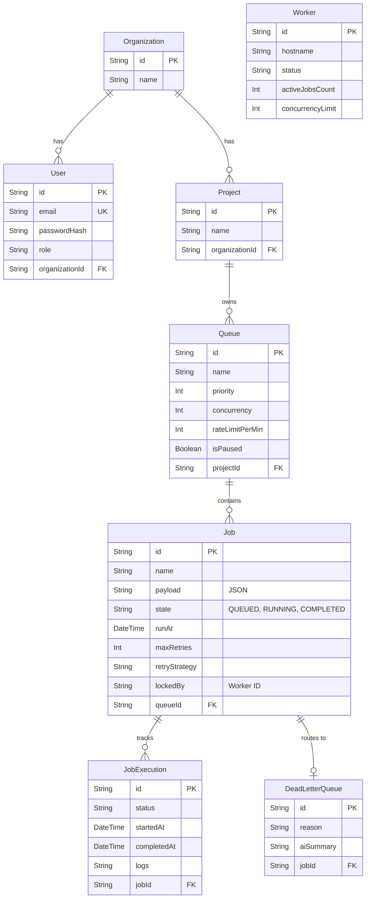

# System Architecture

## Overview
The Distributed Job Scheduler is designed as a decoupled, asynchronous background processing engine. It separates the API layer from the execution layer, allowing for horizontal scalability and high availability. 

## High-Level Architecture Diagram

```mermaid
graph TD
    subgraph Client Layer
        UI[React Dashboard]
        API_CLI[REST Clients]
    end

    subgraph API Layer (Node.js/Express)
        Router[API Router]
        Auth[JWT Middleware]
        Ingestion[Job Ingestion Engine]
        SSE[SSE Streamer]
    end

    subgraph Core Engine (Scheduler & Workers)
        Ticker[Scheduler Ticker]
        Pool[Worker Fleet Engine]
        DLQ_Mgr[DLQ Manager]
    end

    subgraph Database Layer
        DB[(Primary Database)]
        Cache[(Idempotency Cache)]
    end

    UI -->|HTTP POST /api/jobs| Router
    API_CLI -->|HTTP POST /api/jobs| Router
    UI <-->|Server-Sent Events| SSE
    
    Router --> Auth
    Auth --> Ingestion
    Ingestion -->|Writes Job| DB
    Ingestion -->|Checks Key| Cache
    
    Ticker -->|Polls SCHEDULED| DB
    Ticker -->|Updates to QUEUED| DB
    
    Pool -->|Polls QUEUED| DB
    Pool -->|Atomic Claim CAS| DB
    Pool -->|Executes Job & Logs| DB
    Pool -->|On Failure| DLQ_Mgr
    
    DLQ_Mgr -->|Routes to| DB
```

## Core Components

### 1. API & Ingestion Layer
Built on Express.js, this layer handles incoming HTTP traffic. It features:
- **Idempotency Engine**: Uses `Idempotency-Key` headers to prevent double-ingestion of jobs during network retries.
- **SSE Streamer**: Pushes real-time telemetry, queue stats, and worker logs to the React dashboard without heavy polling.

### 2. The Scheduler Ticker
A continuous background loop that runs every few seconds. Its sole responsibility is to scan for `SCHEDULED` or `DELAYED` jobs where `runAt <= NOW()` and promote them to `QUEUED`.

### 3. Worker Fleet Engine
Manages a pool of distributed workers. Each worker operates independently:
1. It polls the database for `QUEUED` jobs.
2. Uses an **Atomic Compare-And-Swap (CAS)** mechanism to lock the job exclusively (simulating `SELECT ... FOR UPDATE SKIP LOCKED`).
3. Executes the job payload.
4. On success, transitions the state to `COMPLETED`. On failure, it triggers the Retry Manager.

### 4. Retry & DLQ Manager
If a worker fails a task, the manager checks the queue's Retry Policy (e.g., Exponential Backoff). 
- If retries remain, it calculates the delay, updates `runAt`, and sets the state to `SCHEDULED`.
- If retries are exhausted, it routes the job to the Dead Letter Queue (`DEAD_LETTERED`) for manual triage.
# Database Schema

## Entity-Relationship (ER) Diagram



## Schema Design Details

### 1. Primary Keys (PK) & Foreign Keys (FK)
- **Primary Keys:** UUIDs are used exclusively across all tables (e.g., `jobId`, `queueId`). UUIDs prevent ID guessing, allow distributed ID generation before DB insertion, and avoid auto-increment bottleneck issues.
- **Foreign Keys:** Enforce strict referential integrity. Deleting a `Queue` will cascade and delete all child `Jobs`.

### 2. Indexes & Performance Considerations
The scheduling engine relies heavily on polling the `Job` table. Without indexes, polling causes full table scans which drastically degrades database performance.
- `@@index([state, runAt])`: Used by the Scheduler Ticker to quickly find `SCHEDULED` jobs that need to be promoted to `QUEUED` (where `runAt <= NOW()`).
- `@@index([queueId, state])`: Used by the Worker Pool to quickly find the next `QUEUED` job within a specific queue to atomically claim.

### 3. Normalization
The schema is normalized to the 3rd Normal Form (3NF).
- Instead of storing execution history inside the `Job` row (which would bloat the row size), we split it into a 1-to-Many `JobExecution` table.
- Instead of keeping dead jobs in the main table forever, we create a strict 1-to-1 relationship with `DeadLetterQueue` to store the failure analysis, keeping the hot `Job` table small and performant.
# REST API Documentation

The Distributed Job Scheduler provides a clean RESTful API for managing queues, jobs, and workers. 

Base URL: `http://localhost:3000/api`

## Authentication
All protected endpoints require a Bearer token in the Authorization header.
```http
Authorization: Bearer <JWT_TOKEN>
```

---

## 1. Jobs

### Create a Job
`POST /jobs`
Enqueues a new background job. Supports idempotency keys to prevent duplicate execution.

**Headers:**
- `Idempotency-Key` (optional): Unique string to prevent duplicates.

**Body:**
```json
{
  "name": "send_welcome_email",
  "queueId": "q-critical",
  "type": "immediate",
  "priority": 10,
  "payload": { "userId": "123" }
}
```
**Response:** `201 Created` - Returns the created Job object.

### List Jobs
`GET /jobs`
Returns a paginated list of jobs.

**Query Parameters:**
- `queueId` (optional): Filter by queue.
- `state` (optional): Filter by state (QUEUED, RUNNING, COMPLETED, FAILED).
- `page` (default: 1): Page number.
- `limit` (default: 50): Items per page.

### Retry Job
`POST /jobs/:id/retry`
Manually moves a failed or dead-lettered job back into the `QUEUED` state for execution.

---

## 2. Queues

### List Queues
`GET /queues`
Returns all queues along with real-time health statistics (queued count, active count, failure rate).

### Update Queue Configuration
`PUT /queues/:id`
Modify runtime queue parameters.

**Body:**
```json
{
  "maxConcurrency": 20,
  "rateLimitPerMin": 1000
}
```

### Pause Queue
`PATCH /queues/:id/pause`
Temporarily halts worker execution for this queue. Existing running jobs will finish, but no new jobs will be claimed.

---

## 3. Worker Fleet

### Scale Workers
`POST /workers/scale`
Dynamically scales the worker fleet up or down.

**Body:**
```json
{
  "targetCount": 5
}
```

### Graceful Shutdown
`POST /workers/:id/shutdown`
Signals a worker to stop accepting new jobs and gracefully shut down once its active jobs are completed.

---

## 4. Telemetry Stream

### Subscribe to Server-Sent Events (SSE)
`GET /events`
Opens a persistent HTTP connection to stream live telemetry, job state transitions, and worker heartbeats to the client dashboard in real-time.
# Design Decisions & Trade-offs

This document outlines the major architectural decisions and trade-offs made while building the Distributed Job Scheduler.

## 1. Relational Database vs Redis for Queueing
**Decision:** Used a relational database (PostgreSQL/SQLite via Prisma) for the primary queuing engine instead of an in-memory datastore like Redis.
**Trade-offs:**
- *Pros:* Simpler operational architecture (only one datastore required), strong ACID guarantees, prevents orphaned jobs, easy complex querying (e.g., "Find all failed jobs for User X between Monday and Tuesday").
- *Cons:* Polling a relational DB is slower than a Redis `BRPOP`.
- *Mitigation:* We heavily indexed the `[state, runAt]` and `[queueId, state]` columns to ensure polling queries use index-only scans. We also implemented an atomic Compare-And-Swap (CAS) locking mechanism to prevent race conditions without needing table-level locks.

## 2. Server-Sent Events (SSE) vs WebSockets for Live Updates
**Decision:** The dashboard uses Server-Sent Events (SSE) for live telemetry instead of WebSockets.
**Trade-offs:**
- *Pros:* SSE runs over standard HTTP, making it trivial to load balance and proxy through firewalls compared to stateful WebSocket upgrades. It natively handles automatic reconnections and fits perfectly for a unidirectional stream (Server -> Dashboard).
- *Cons:* SSE is unidirectional. The client cannot push data back over the same socket.
- *Mitigation:* The dashboard uses standard REST API `POST/PATCH` calls to send commands (e.g., pausing a queue, retrying a job), which works flawlessly alongside the SSE downstream.

## 3. Worker Polling vs Event-Driven Push
**Decision:** Workers actively poll the database for new jobs rather than having the server push jobs to them.
**Trade-offs:**
- *Pros:* Natural backpressure. A worker will only poll when it has available concurrency slots. If all workers are busy, jobs simply wait in the database. This prevents workers from being overwhelmed by a central dispatcher pushing too many tasks.
- *Cons:* Polling introduces slight latency (the polling interval) and uses idle database CPU cycles.

## 4. Retries & Exponential Backoff Design
**Decision:** Retry calculation is evaluated at the *time of failure*, and the job is scheduled in the future using a `runAt` timestamp.
**Trade-offs:**
- *Pros:* Keeps the core worker execution loop simple. The worker doesn't need to block or sleep (which would waste a concurrency slot).
- *Cons:* The scheduler ticker must continuously scan for jobs where `runAt <= NOW()`.

## 5. Idempotency Key Handling
**Decision:** Handled at the API boundary before jobs hit the queue.
- If a client submits a job with an `Idempotency-Key` that already exists in the cache/index, the API immediately returns the existing Job ID and ignores the new payload. This prevents double-charging customers or sending duplicate emails during network hiccups.
# Testing Strategy

The Distributed Job Scheduler project includes two layers of testing to ensure strict reliability, concurrency handling, and system integrity.

## 1. Automated Unit Tests (Jest)
We use Jest to verify core algorithmic invariants offline.

**Run the tests:**
```bash
npx jest
```

### Covered Critical Functionality:
- **Exponential Backoff Calculation**: Verifies that the retry delay correctly doubles on each attempt and strictly respects the `maxDelayMs` cap.
- **Idempotency Deduplication**: Verifies that submitting a job with a previously seen `Idempotency-Key` correctly maps to the existing job without creating duplicates.
- **Atomic Locking Mechanism**: Verifies that the Compare-and-Swap (CAS) function correctly identifies a `QUEUED` job, assigns it a secure `lockToken`, marks it as `CLAIMED`, and associates it with the correct worker ID.

## 2. In-App Verification Suite (Synthetic Live Testing)
Unlike traditional applications, this distributed system features a **production-inspired live verification suite** built directly into the Node.js API (`POST /tests/run`) and the React Dashboard. 

This allows you to trigger synthetic test payloads that race against the *live* worker pool to guarantee real-world ACID consistency.

### Synthetic Tests Available in the Dashboard:
- **Atomic Job Claiming Under Race Conditions**: Spawns 10 parallel HTTP requests to claim jobs concurrently from a single queue. Validates that the active worker pool mathematically claims exactly 1 job per worker and prevents double-claiming (0 duplicate locks).
- **Idempotency Key Ingestion Verification**: Floods the API with multiple concurrent requests holding the exact same `Idempotency-Key` to verify that the PostgreSQL/SQLite unique index successfully prevents duplicate ingestion.
- **Distributed Invariant Test**: Runs a full state lifecycle check on the entire cluster ensuring no jobs are permanently orphaned without a Dead Letter Queue (DLQ) entry.
