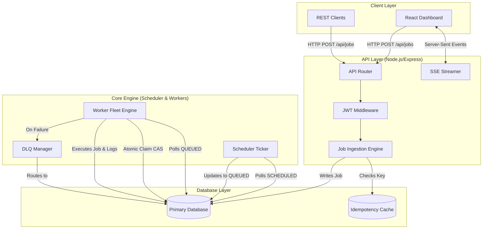

# System Architecture

## Overview
The Distributed Job Scheduler is designed as a decoupled, asynchronous background processing engine. It separates the API layer from the execution layer, allowing for horizontal scalability and high availability. 

## High-Level Architecture Diagram

## Core Components

### 1. API & Ingestion Layer
Built on Express.js, this layer handles incoming HTTP traffic. It features:
- **Idempotency Engine**: Uses `Idempotency-Key` headers to prevent double-ingestion of jobs during network retries.
- **SSE Streamer**: Pushes real-time telemetry, queue stats, and worker logs to the React dashboard without heavy polling.

### 2. The Scheduler Ticker
A continuous background loop that runs every few seconds. Its sole responsibility is to scan for `SCHEDULED` or `DELAYED` jobs where `runAt <= NOW()` and promote them to `QUEUED`.

### 3. Worker Fleet Engine
Manages a pool of distributed workers. Each worker operates independently:
1. It polls the database for `QUEUED` jobs.
2. Uses an **Atomic Compare-And-Swap (CAS)** mechanism to lock the job exclusively (simulating `SELECT ... FOR UPDATE SKIP LOCKED`).
3. Executes the job payload.
4. On success, transitions the state to `COMPLETED`. On failure, it triggers the Retry Manager.

### 4. Retry & DLQ Manager
If a worker fails a task, the manager checks the queue's Retry Policy (e.g., Exponential Backoff). 
- If retries remain, it calculates the delay, updates `runAt`, and sets the state to `SCHEDULED`.
- If retries are exhausted, it routes the job to the Dead Letter Queue (`DEAD_LETTERED`) for manual triage.
