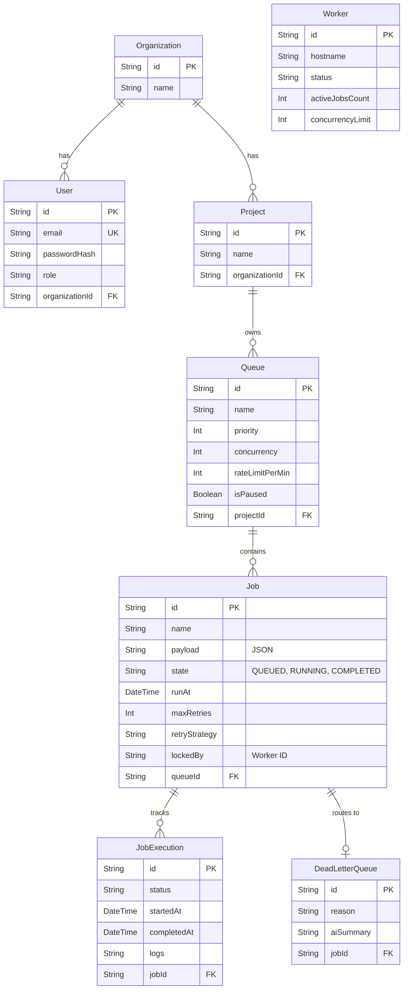

# Database Schema

## Entity-Relationship (ER) Diagram

## Schema Design Details

### 1. Primary Keys (PK) & Foreign Keys (FK)
- **Primary Keys:** UUIDs are used exclusively across all tables (e.g., `jobId`, `queueId`). UUIDs prevent ID guessing, allow distributed ID generation before DB insertion, and avoid auto-increment bottleneck issues.
- **Foreign Keys:** Enforce strict referential integrity. Deleting a `Queue` will cascade and delete all child `Jobs`.

### 2. Indexes & Performance Considerations
The scheduling engine relies heavily on polling the `Job` table. Without indexes, polling causes full table scans which drastically degrades database performance.
- `@@index([state, runAt])`: Used by the Scheduler Ticker to quickly find `SCHEDULED` jobs that need to be promoted to `QUEUED` (where `runAt <= NOW()`).
- `@@index([queueId, state])`: Used by the Worker Pool to quickly find the next `QUEUED` job within a specific queue to atomically claim.

### 3. Normalization
The schema is normalized to the 3rd Normal Form (3NF).
- Instead of storing execution history inside the `Job` row (which would bloat the row size), we split it into a 1-to-Many `JobExecution` table.
- Instead of keeping dead jobs in the main table forever, we create a strict 1-to-1 relationship with `DeadLetterQueue` to store the failure analysis, keeping the hot `Job` table small and performant.
